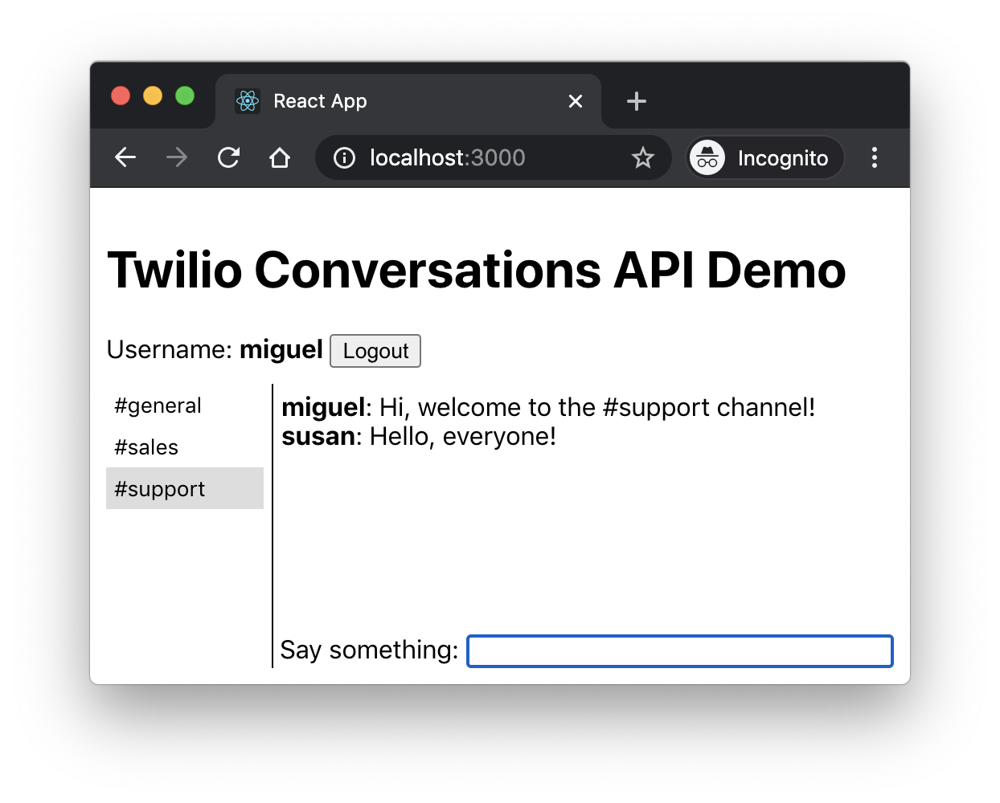

# flask-react-twilio-chat

This is a chat application based on the Twilio Conversations API and built with a Flask back end and a React front end.

## Installation Instructions

To install the application on your system follow these steps:

1. [Create a Twilio account](https://www.twilio.com/referral/7fB3Je) (if you don't have one yet). It's free!
2. [Generate an API Key](https://www.twilio.com/console/project/api-keys) for your account.
3. Clone this repository.
4. Run `npm install` to install the front end dependencies.
5. Change to the *api* sub-directory. Create a virtualenv with the name *venv* and install the requirements.
6. Still in the *api* sub-directory, create a *.env* file by copying the *.env.template* file. Fill out the values for your Twilio account's SID, Auth Token, API Key SID and API Key Secret.
7. Create one or more chatrooms by running the command `flask chatrooms create "name"`. Use `flask chatrooms list` to see the list of channels that have been created, and `flask chatrooms delete "name"` to remove a channel. 
8. Back in the top-level directory, execute `yarn start-api` to start the API server.
9. In a second terminal window, run `yarn start` to start the React server.
10. Navigate to *http://localhost:3000* on your web browser. Pick a username and log in. The app does not do password validation, so any name will be accepted.
